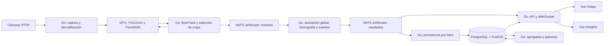

# Aeropuerto Jorge Chávez: flujo y estructura de implementación

Documento de diseño · 6 de septiembre de 2026

Este documento define cómo construir el sistema mostrado en las láminas: video CCTV → tracking multicámara → coordenadas del aeropuerto → eventos → históricos → insights comerciales. La entrega actual es únicamente esta guía; los servicios, migraciones y contenedores descritos se implementarán siguiendo la ruta de trabajo. No hay una aplicación desplegada todavía.

## 1. Alcance y decisiones

- **Base de datos:** PostgreSQL con PostGIS. Se interpreta «postgrest» como PostgreSQL, de acuerdo con la arquitectura adjunta. PostgREST es otro producto y no se necesita: Go expondrá la API.
- **Backend:** un único proyecto Go con módulos y varios comandos ejecutables para API, procesamiento en tiempo real, persistencia y analítica. Todos comparten contratos; cada proceso escala según su carga.
- **Inferencia:** YOLO11m y TransReID ya preentrenados, servidos por un runtime GPU separado; no se contempla entrenamiento. ByteTrack mantiene el estado de tracking y no es un servicio de entrenamiento.
- **Frontend:** una aplicación Vue 3 + TypeScript con dos rutas independientes, `/mapa` y `/insights`, que se pueden abrir en ventanas distintas.
- **Infraestructura inicial:** Docker Compose en un servidor Linux con GPU para el piloto; PostgreSQL/PostGIS, NATS JetStream, runtime de inferencia, servicios Go y frontend en contenedores.
- **Escala:** incorporar nodos de procesamiento por grupos de cámaras y después orquestación multinodo si las mediciones lo justifican. Compose en una sola máquina no ofrece alta disponibilidad.
- **Identidad:** `global_id` es un identificador seudónimo de sesión, no nombre, documento ni identidad civil. ReID puede equivocarse; conservar confianza y calidad de cobertura en los resultados.

El plano, ubicaciones de cámaras, polígonos y umbrales se deben levantar en campo. Las zonas de ejemplo y cifras de las láminas son ilustrativas, no mediciones del aeropuerto.

## 2. Arquitectura y recorrido de los datos



Los frames circulan entre captura e inferencia dentro del nodo, por memoria o transporte binario acotado. NATS transporta metadatos, nunca el video completo. PostgreSQL guarda geometrías, sesiones, trayectorias muestreadas, visitas y eventos; no una imagen por detección.

La API publica el estado actual por WebSocket y consulta históricos por HTTP. El mapa no espera a una consulta SQL por persona. La ventana de insights consulta agregados y presenta `data_through`, cobertura y fecha de actualización.

### Responsabilidad de cada proceso

| Proceso/contenedor | Entrada | Responsabilidad | Salida |
|---|---|---|---|
| `ingest` | RTSP, configuración de cámara | Decodificar, aplicar FPS objetivo, detectar desconexión, inferir y mantener ByteTrack por cámara | Tracklets y observaciones con embeddings seleccionados |
| `inference` | Tensores, modelo y versión | Ejecutar YOLO y TransReID con GPU | Detecciones o embeddings |
| `realtime` | Tracklets ordenados | ReID global, proyección al plano, fusión multicámara, zonas y máquina de eventos | Posiciones canónicas, transiciones y revisiones |
| `writer` | Resultados durables | Deduplicar, escribir lotes, confirmar mensajes tras commit | Histórico consistente |
| `api` | HTTP/WS y resultados | Autenticación, consultas, snapshots y deltas | Datos para ambas vistas |
| `analytics` | Histórico consolidado | Ocupación, permanencias, OD, heatmaps, rutas y métricas | Tablas agregadas/versionadas |
| `web` | API y WebSocket | Servir Vue y proxy `/api`, `/ws` | `/mapa` y `/insights` |

## 3. Contrato de modelos preentrenados

Antes de integrar, recibir para cada modelo: pesos, checksum SHA-256, licencia de uso, versión, tamaño y orden del tensor, RGB/BGR, normalización, clases, umbrales, formato de salida y dataset de evaluación autorizado. Registrar todo en un manifiesto. No asumir que dos archivos `.onnx` aceptan el mismo preprocesamiento.

1. Validar YOLO11m en clips representativos: detección de persona, cajas y confianza.
2. Validar TransReID: resolución de crop, dimensión `D`, normalización L2 y posibles entradas auxiliares de cámara/vista según el checkpoint. No asumir `D=768` sin inspeccionarlo.
3. Comparar salida del modelo original frente al exportado con ejemplos fijos. Exportar no equivale a entrenar; puede requerir adaptación del grafo.
4. Usar Triton como servidor de inferencia si los modelos exportados son compatibles. Si TransReID no se exporta correctamente, encapsular su inferencia original en un backend Python del runtime; la lógica del sistema y API continúa en Go.
5. Configurar lotes dinámicos solo para inferencias sin estado y con espera máxima medida. Mantener ByteTrack fuera del batching compartido, con estado independiente por cámara.
6. Cargar pesos como volumen de solo lectura; no subirlos junto con videos al repositorio.

La configuración de formas, backends e instancias corresponde al contrato del [runtime Triton](https://docs.nvidia.com/deeplearning/triton-inference-server/user-guide/docs/user_guide/model_configuration.html). Consultar las implementaciones de [YOLO11](https://docs.ultralytics.com/models/yolo11/) y [TransReID](https://github.com/damo-cv/TransReID) para comprobar compatibilidad del checkpoint concreto.

## 4. Pipeline de tracking multicámara

### 4.1 Captura y tracking local

Por cámara: abrir RTSP con FFmpeg/GStreamer desde el proceso Go, decodificar cerca de la GPU y conservar una cola corta con límite de memoria. Configurar resolución y FPS según el benchmark. Como punto inicial experimental, probar 5–10 FPS de inferencia, sin confundirlos con los FPS originales del stream.

- Sincronizar relojes por NTP/PTP donde sea posible. Guardar `captured_at`, `received_at`, PTS y calidad del reloj; alinear PTS con UTC y no usar únicamente la hora de recepción.
- Emitir `camera_id`, `camera_session_id`, `frame_seq`, dimensiones y versión del modelo.
- YOLO detecta personas; ByteTrack asocia detecciones consecutivas de esa cámara. Una implementación en Go debe reproducir el comportamiento de referencia con clips comparables; no basta una asociación por distancia.
- La clave local es `(camera_id, camera_session_id, local_track_id)`. Reiniciar la cámara o tracker genera una nueva sesión para evitar reciclar IDs históricos.
- Seleccionar crops por nitidez, tamaño, oclusión y diversidad de vista; calcular ReID solo al iniciar/actualizar un tracklet, no para cada frame de cada persona.
- L2-normalizar embeddings; conservar un número limitado de representantes por tracklet y sesión global, con TTL y versión del modelo.

### 4.2 Asociación global

Construir un grafo dirigido de cámaras con portales de entrada/salida, piso, solapamiento y tiempos mínimo/máximo de traslado medidos. Para cada tracklet:

1. Buscar sesiones globales recientes en cámaras vecinas compatibles; excluir pisos sin conexión y desplazamientos físicamente imposibles.
2. Calcular similitud coseno entre representantes compatibles y añadir costos por tiempo, distancia y calidad. Calibrar umbrales con datos etiquetados del piloto.
3. Resolver Hungarian sobre un conjunto acotado de candidatos. Incluir candidatos ficticios para «sin coincidencia»; el algoritmo no debe forzar asignaciones.
4. Aceptar solo si pasa el umbral y el margen frente al segundo candidato; en ambigüedad mantener una identidad provisional o crear una nueva.
5. Actualizar memoria multivista solo con asociaciones de alta confianza; una mala asociación no debe contaminar toda la galería.
6. En solapamientos, permitir que varias cámaras observen el mismo ID simultáneamente. Fusionar observaciones compatibles en una posición canónica por ventana temporal para evitar doble conteo.

Procesar por tiempo de captura con una ventana de reordenamiento inicial configurable, por ejemplo 500 ms; medirla con el jitter real. Eventos más tardíos se almacenan como correcciones históricas y no retroceden el cursor del mapa. Versionar decisiones y registrar alias/revisiones de identidad para poder recalcular visitas afectadas.

**Estado y escala:** comenzar con un único propietario de asociación por grupo conectado de cámaras. Escalar ingestión independientemente. Al dividir grupos, implementar un protocolo de traspaso de identidad en las cámaras frontera; dividir arbitrariamente por `camera_id` rompe ReID global. Usar leases con fencing para impedir dos propietarios activos; checkpoint durable de galerías y offsets antes de confirmar entrada, o commit de resultados al bus con IDs deterministas y replay acotado. Una cola de consumidores genérica no garantiza propiedad ni orden por cámara.

## 5. Mapeo sobre el aeropuerto

### 5.1 Plano base y coordenadas

Referencia proporcionada: [mapa público del aeropuerto, piso 3](https://map.lima-airport.com/?floor=3&lang=es-PE&source=website_header#15.98/-12.028493/-77.116766/-25.8). La página es una aplicación JavaScript; no se ha obtenido de ella un plano vectorial, dimensiones, API ni posiciones de cámaras. La captura adjunta sirve para orientar el diseño visual, no como calibración métrica.

Solicitar u obtener un plano autorizado por piso (SVG, imagen o vector), escala, dimensiones y puntos de control. Guardar `floor_id`, `map_version`, origen, orientación y transformación de coordenadas. No depender de un iframe del sitio externo: no da acceso garantizado a sus capas ni permite superponer personas de manera controlada.

Para el piloto usar coordenadas locales en metros: origen fijo, X hacia la derecha del plano y Y hacia arriba; `geometry(...,0)` identifica el sistema local, cuya unidad se documenta explícitamente. No etiquetar metros como EPSG:4326. Para la imagen, documentar transformación afín `X,Y → px,py`, incluida inversión del eje vertical. Si después se georreferencia, medir puntos y definir la transformación a un CRS métrico apropiado; convertir a WGS84 únicamente al servir capas geográficas.

### 5.2 Calibración

Por cámara fija y por superficie aproximadamente plana:

1. Corregir distorsión de lente si corresponde.
2. Medir al menos cuatro puntos no colineales del suelo visibles en imagen y plano, preferentemente más y distribuidos por el área útil.
3. Estimar homografía con RANSAC y evaluar con puntos reservados, no solo con los usados para ajustar.
4. Guardar matriz 3×3, resolución, ROI válida, error en metros, fechas y versión. Recalibrar ante movimiento de cámara, zoom o cambio de resolución.
5. Tomar el punto de pies de `bbox=[x1,y1,x2,y2]`: `u=(x1+x2)/2`, `v=y2`. Si la caja estaba sobre una imagen redimensionada/letterboxed, invertir esa transformación antes de aplicar H.

```text
[a, b, w]ᵀ = H × [u, v, 1]ᵀ
X = a / w
Y = b / w
```

Rechazar `w` próximo a cero, puntos fuera de ROI y saltos incompatibles con velocidad/tiempo. Cuando los pies estén ocluidos, marcar baja confianza. Escaleras, rampas y varios niveles necesitan superficies/calibraciones separadas o un modelo 3D; una sola H no los resuelve. Cámaras PTZ requieren pose conocida y calibración por pose, o quedan fuera del piloto.

### 5.3 Zonas y rutas

Definir polígonos versionados: entrada, check-in, seguridad, pasillo, tienda, frente de tienda, cola y puerta. Separar el frente comercial del interior para calcular captación. Permitir múltiples pertenencias semánticas y elegir una zona principal por prioridad explícita para la secuencia de recorrido.

Aplicar `ST_Covers(polígono,punto)` para incluir bordes y filtrar siempre por piso y versión del plano; [PostGIS documenta esta semántica](https://postgis.net/docs/ST_Covers.html). Cachear polígonos en Go e indexarlos espacialmente para procesar el tiempo real; PostGIS conserva la definición y verifica históricos.

Las rutas **observadas** unen posiciones válidas por sesión. No dibujar líneas atravesando paredes o huecos largos de cobertura: cortar segmentos y mostrarlos como desconocidos. Opcionalmente crear un grafo de pasillos/portales para rutas **recomendadas** usando Dijkstra/A*, sin presentar una ruta estimada como observada. Ejemplo de recorrido conceptual: Entrada → Check-in → Seguridad → Tienda → Puerta; las conexiones reales se levantan sobre el plano.

## 6. Máquina de eventos

Por `(global_id, zone_version_id)` mantener `outside`, `enter_candidate`, `inside`, `exit_candidate`, `unknown`. Usar histéresis espacial y permanencia mínima temporal para que el ruido en el borde no multiplique eventos. Todos los umbrales siguientes son configurables y requieren validación.

| Evento | Regla implementable |
|---|---|
| `ENTER` | De fuera a dentro confirmado durante el tiempo mínimo; conservar instante de primer cruce y de confirmación |
| `EXIT` | De dentro a fuera confirmado; cerrar visita con tiempo del cruce |
| `DWELL` | Visita activa supera un umbral; emitir una vez por umbral, no en cada frame |
| `PASS_BY` | Visita confirmada al polígono frontal; crear un episodio de exposición comercial |
| `PASILLO` | Tránsito confirmado por zona de tipo pasillo; no sustituye a ENTER/EXIT |
| `RETURN` | Nuevo ENTER tras una visita cerrada del mismo ID a esa zona, dentro de ventana definida |
| `QUEUE` | Permanencia y baja velocidad en polígono de cola durante un mínimo; señal estimada, no intención demostrada |

Si se pierde una persona, pasar a `unknown`, conservar `last_seen_at` y cerrar por timeout como visita incompleta/censurada. No fabricar un EXIT observado. Una cámara offline vuelve desconocida su cobertura; no convierte automáticamente su ocupación en cero. Los cambios de configuración no reescriben silenciosamente el pasado.

Cada evento tiene ID determinista, revisión, tiempos de captura/procesamiento, regla y confianza. Persistir el resultado antes del ACK del consumidor durable. Los duplicados del bus no deben sumar nuevas visitas.

## 7. Modelo de datos PostgreSQL/PostGIS

### 7.1 Entidades y relaciones

Todas las fechas se almacenan en UTC con `timestamptz`; los reportes por día/franja usan `America/Lima`. Usar UUID para entidades, `bigint` para contadores y claves compuestas cuando el volumen/particionado lo requiera.

| Tabla | Campos principales y propósito |
|---|---|
| `airports` | `id`, código, nombre, timezone |
| `floors` | `id`, `airport_id`, nombre, nivel |
| `map_versions` | `id`, `floor_id`, archivo/checksum, origen, escala, transformación a píxeles, vigencia |
| `cameras` | `id`, `floor_id`, nombre, referencia al secreto RTSP, habilitada |
| `camera_sessions` | `id`, `camera_id`, inicio/fin, motivo de reinicio |
| `calibrations` | `id`, `camera_id`, `map_version_id`, H[9], resolución, ROI, error, vigencia |
| `camera_edges` | cámara origen/destino, portal, tiempo mínimo/máximo, solapamiento, versión |
| `zones` | Identidad estable de tienda/zona y tipo |
| `zone_versions` | `id`, `zone_id`, `map_version_id`, polígono, prioridad, área útil, vigencia |
| `tracking_sessions` | `global_id`, inicio, último avistamiento, cierre, confianza, estado |
| `tracklets` | `id`, cámara/sesión/local ID, inicio/fin, calidad; UNIQUE sobre la clave local |
| `identity_assignments` | tracklet, global ID, intervalo, revisión, confianza, modelo y algoritmo |
| `identity_aliases` | ID sustituido/canónico, revisión y motivo de reconciliación |
| `positions` | ID observación, tiempo, ID global, cámara, calibración, plano, punto, confianza |
| `zone_events` | ID evento, revisión, ID global, versión de zona, tipo, tiempos y regla |
| `visits` | ID visita, ID global, zona, entrada/salida, última observación, estado completo/censurado |
| `exposures` | Episodios frente a tienda, global ID, entrada/salida, visita captada vinculada |
| `zone_metrics_1m` | Zona, minuto, conteos, segundos-persona, tiempo con cobertura, versión de cálculo |
| `od_metrics_15m` | Origen/destino, intervalo, transiciones, duración y versión |
| `heatmap_cells_5m` | Piso/plano, celda métrica, intervalo, segundos-persona, cobertura |
| `route_patterns_daily` | Fecha, alcance, secuencia de zonas, soporte, denominador y versión |
| `analytics_runs` | Job, ventana, watermark, versión, estado y error |
| `processed_messages` | Consumidor + message ID, expiración para deduplicación transaccional |
| `outbox` | Mensajes derivados pendientes de publicar, cuando una transacción SQL genera eventos |

Los embeddings se mantienen en memoria/checkpoints privados de corta duración, separados del histórico comercial. Si se necesita búsqueda persistente, evaluar pgvector con dimensión fija por modelo; no comparar embeddings de versiones incompatibles. El primer piloto puede buscar en la galería acotada sin añadir una base vectorial.

### 7.2 SQL orientativo del núcleo espacial

Este fragmento es un punto de partida, no la migración completa de todas las entidades anteriores. Los UUID los genera el backend. Las referencias restantes y políticas de acceso se agregan en las migraciones del proyecto.

```sql
CREATE EXTENSION IF NOT EXISTS postgis;

CREATE TABLE floors (
    id uuid PRIMARY KEY,
    name text NOT NULL
);
CREATE TABLE map_versions (
    id uuid PRIMARY KEY,
    floor_id uuid NOT NULL REFERENCES floors(id),
    asset_uri text NOT NULL,
    valid_from timestamptz NOT NULL,
    UNIQUE (id, floor_id)
);
CREATE TABLE zones (
    id uuid PRIMARY KEY,
    name text NOT NULL,
    kind text NOT NULL
);
CREATE TABLE zone_versions (
    id uuid PRIMARY KEY,
    zone_id uuid NOT NULL REFERENCES zones(id),
    map_version_id uuid NOT NULL,
    floor_id uuid NOT NULL,
    geom geometry(Polygon, 0) NOT NULL,
    priority integer NOT NULL DEFAULT 0,
    valid_from timestamptz NOT NULL,
    valid_to timestamptz,
    FOREIGN KEY (map_version_id, floor_id) REFERENCES map_versions(id, floor_id),
    CHECK (ST_IsValid(geom) AND NOT ST_IsEmpty(geom)),
    CHECK (ST_Area(geom) > 0),
    CHECK (valid_to IS NULL OR valid_to > valid_from)
);
CREATE INDEX zone_versions_geom_gist ON zone_versions USING gist (geom);

CREATE TABLE positions (
    observed_at timestamptz NOT NULL,
    observation_id uuid NOT NULL,
    global_id uuid NOT NULL,
    camera_id uuid NOT NULL,
    calibration_id uuid NOT NULL,
    floor_id uuid NOT NULL,
    map_version_id uuid NOT NULL,
    geom geometry(Point, 0) NOT NULL,
    confidence real NOT NULL CHECK (confidence BETWEEN 0 AND 1),
    quality_flags text[] NOT NULL DEFAULT '{}',
    PRIMARY KEY (observed_at, observation_id),
    FOREIGN KEY (map_version_id, floor_id) REFERENCES map_versions(id, floor_id)
) PARTITION BY RANGE (observed_at);

-- Ejemplo: el job de mantenimiento crea particiones futuras automáticamente.
CREATE TABLE positions_20260906 PARTITION OF positions
    FOR VALUES FROM ('2026-09-06 00:00:00+00') TO ('2026-09-07 00:00:00+00');
CREATE INDEX positions_session_time ON positions (global_id, observed_at);
CREATE INDEX positions_floor_time ON positions (floor_id, observed_at);
CREATE INDEX positions_time_brin ON positions USING brin (observed_at);
-- Añadir GiST a positions solo si las consultas espaciales reales lo justifican.

-- Posición local en metros: misma versión del plano y vigencia del evento.
SELECT zone_id, id AS zone_version_id
FROM zone_versions
WHERE floor_id = $1 AND map_version_id = $2
  AND valid_from <= $5 AND (valid_to IS NULL OR $5 < valid_to)
  AND ST_Covers(geom, ST_SetSRID(ST_MakePoint($3, $4), 0))
ORDER BY priority DESC, zone_id;
```

La clave única de una tabla particionada incluye la columna temporal; por eso `observation_id` por sí solo no garantiza unicidad global en esta tabla. El productor debe reutilizar ID **y tiempo** en reintentos; `processed_messages` cubre efectos transaccionales adicionales. La administración de particiones sigue la [documentación de PostgreSQL](https://www.postgresql.org/docs/current/ddl-partitioning.html).

### 7.3 Escritura, retención y consultas

- Escribir con `pgx`: lotes iniciales de 500–2.000 filas o 100–500 ms, lo que ocurra primero; ajustar por latencia medida. Para COPY, cargar staging y aplicar `INSERT ... ON CONFLICT` dentro de la transacción; COPY no implementa por sí solo UPSERT.
- Muestrear posiciones persistidas por tiempo/desplazamiento; conservar todos los eventos confirmados. La frecuencia del mapa y la frecuencia del histórico pueden ser distintas.
- Crear particiones futuras y alertar antes de quedarse sin ellas. Elegir día/semana según tamaño real. Retirar particiones solo después de consolidar y cumplir la retención aprobada.
- Propuesta técnica inicial: posiciones 7 días, visitas/eventos 90 días, agregados 12 meses; embeddings/checkpoints únicamente durante el horizonte de continuidad más una tolerancia. Estas duraciones son configurables y requieren validación con el responsable de los datos.
- Evitar videos/crops persistentes por defecto. Para depuración autorizada, almacenamiento separado cifrado y con TTL, no columnas binarias en PostgreSQL.
- Limitar rango temporal, paginar trayectorias y usar consultas sobre agregados en dashboards. Las sumas de «usuarios únicos por minuto» no equivalen a únicos diarios.
- Definir un presupuesto total de conexiones: réplicas × tamaño del pool + jobs + administración menor que el límite de PostgreSQL. Añadir PgBouncer cuando las réplicas lo requieran.
- Roles separados para migraciones, escritura, lectura y reportes. El navegador nunca se conecta directamente a la base de datos.

## 8. Histórico e insights

### 8.1 Consolidación

Un job incremental procesa ventanas por tiempo de evento con watermark y margen de tardanza. Ordena por sesión, elimina duplicados, resuelve revisiones de identidad, filtra saltos y divide trayectorias ante huecos. Suavizar solo segmentos continuos; no interpolar a través de pisos, paredes o pérdidas prolongadas.

Construir visitas y secuencias de zonas sin repeticiones consecutivas. Conservar tiempos originales y versiones de reglas. Recalcular ventanas afectadas por datos tardíos mediante reemplazo/upsert atómico de agregados, no sumando otra vez. Guardar `data_through`, `computed_at`, `revision`, cobertura y tamaño de muestra. Un período fuera del horizonte de corrección debe marcarse pendiente de backfill.

### 8.2 Definiciones de negocio

| Métrica | Cálculo y condiciones |
|---|---|
| Visitas | Conteo de episodios ENTER confirmados; mostrar además sesiones únicas, sin confundirlas |
| Personas únicas | Distintos IDs canónicos en el alcance elegido; estimación dependiente de ReID y cobertura |
| Pass-by | Episodios de exposición al frente comercial; distinguir episodios y sesiones únicas |
| Capture rate | Sesiones expuestas que entraron dentro de una ventana de atribución / sesiones expuestas elegibles, ×100; misma tienda, período y cohorte. Si denominador=0, devolver null |
| Dwell time | Salida menos entrada por visita completa; informar media, mediana y percentiles junto a proporción censurada |
| Densidad instantánea | Personas activas canónicas de la zona / área útil observada en m²; indicar cobertura |
| Ocupación media | Integral de ocupación en segundos-persona / segundos con cobertura válida |
| Congestión | Tiempo sobre umbral de ocupación/densidad definido por zona; umbral operacional configurable |
| Espacio subutilizado | Fracción de área-tiempo observable bajo umbral; explicitar horizonte y cobertura |
| Flujo OD | Transiciones entre zonas consecutivas por sesión; contar transiciones y también sesiones si se solicita |

Para períodos que cruzan medianoche o filtros, definir si la cohorte se atribuye a fecha de exposición/entrada y esperar su ventana de conversión. La pérdida de cobertura no es ausencia de personas. No mezclar personas instantáneas con visitantes acumulados en personas/m².

### 8.3 Heatmaps, rutas y recomendaciones

- **Heatmap:** acumular segundos-persona por celda métrica y ventana, con tope de intervalo por observación para no extender huecos. Así una cámara de más FPS no genera artificialmente un hotspot. Aplicar KDE sobre datos ponderados si hace falta una superficie suave; recortar por superficies transitables y mostrar unidad/leyenda.
- **Rutas frecuentes:** iniciar contando secuencias completas normalizadas. Añadir PrefixSpan para subsecuencias con soporte mínimo y longitudes acotadas. Indicar que una subsecuencia frecuente no implica trayecto completo y que los porcentajes de subsecuencias pueden superar 100% al sumarse.
- **Flujo entre zonas:** grafo origen-destino con dirección, cantidad y tiempo de traslado de transiciones válidas. Excluir gaps que impidan inferir continuidad.
- **Permanencia:** percentiles desde visitas o estructura mergeable validada; no promediar percentiles de minutos para obtener percentiles diarios.
- **Congestión y captación:** mostrar asociación estadística estratificada por hora, cobertura y tienda; no afirmar causalidad ni pérdida de ventas sin datos adicionales.
- **Opportunity score:** indicador exploratorio con fórmula explícita, por ejemplo suma ponderada de flujo normalizado, permanencia y baja congestión. Versionar pesos y normalización. El componente oferta necesita datos de locales/categorías que CCTV no produce. No presentar el score como ingresos estimados.

## 9. Backend Go: módulos y contratos

Usar un solo `go.mod`, `context.Context` con cancelación, pools acotados, límites por solicitud, timeouts y cierre ordenado. HTTP estándar o un router liviano; `pgx` para PostgreSQL y cliente NATS para mensajería. Fijar versiones en `go.mod`/`go.sum` al implementar.

### 9.1 Mensajes internos

Subjects propuestos: `tracking.tracklets.<group>`, `tracking.positions.<floor>`, `tracking.events.<floor>`, `tracking.revisions.<group>`, `camera.health.<camera>` y `tracking.deadletter`. Identificadores usados en subjects deben normalizarse.

```json
{
  "schema_version": 1,
  "message_id": "uuid-estable-en-reintentos",
  "captured_at": "2026-09-06T15:30:00.125Z",
  "received_at": "2026-09-06T15:30:00.210Z",
  "camera_id": "uuid-camara",
  "camera_session_id": "uuid-sesion-camara",
  "local_track_id": 15,
  "global_id": "uuid-sesion-global",
  "floor_id": "uuid-piso",
  "map_version_id": "uuid-plano",
  "calibration_id": "uuid-calibracion",
  "position": {"x_m": 14.3, "y_m": 8.7},
  "confidence": 0.92,
  "identity_revision": 1,
  "quality_flags": []
}
```

El ejemplo muestra posiciones; tracklets, eventos y revisiones tienen esquemas propios. Versionarlos en JSON Schema/Protobuf. Las cajas usan coordenadas de la imagen original e incluyen ancho/alto. Los embeddings solo se incluyen en mensajes internos de asociación, nunca en el WebSocket del navegador.

[JetStream](https://docs.nats.io/concepts/jetstream) permite persistencia y reentrega: diseñar consumidores idempotentes, ACK explícito y retención suficiente para replay. Writer y API deben tener consumidores independientes; compartir el mismo consumidor repartiría los datos entre ellos en vez de entregarles a ambos lo necesario.

### 9.2 API pública

| Método y ruta | Uso |
|---|---|
| `GET /api/v1/floors` | Pisos y plano vigente |
| `GET /api/v1/floors/{id}/map` | Asset, versión y transformación local |
| `GET /api/v1/floors/{id}/zones` | Polígonos y metadatos |
| `GET /api/v1/live/snapshot?floor_id=...` | Estado actual con epoch/cursor |
| `GET /ws/v1/live?floor_id=...` | Snapshot inicial y deltas de posiciones/ocupación |
| `GET /api/v1/tracks/{id}?from=...&to=...` | Trayectoria paginada autorizada |
| `GET /api/v1/insights/summary` | Métricas, cobertura y fecha de actualización |
| `GET /api/v1/insights/heatmap` | Celdas por piso, tiempo y resolución |
| `GET /api/v1/insights/routes` | Rutas frecuentes y denominadores |
| `GET /api/v1/insights/flows` | Grafo OD |
| `GET /api/v1/insights/dwell` | Distribuciones de permanencia |
| `POST /api/v1/admin/calibrations` | Registrar nueva versión, validar y activar |
| `POST /api/v1/admin/zones` | Registrar zonas versionadas |
| `GET /health/live`, `GET /health/ready` | Vida del proceso y capacidad de atender |

Parámetros de insights: `floor_id`, `from`, `to`, `zone_id`, resolución y timezone. Rechazar rangos excesivos; respuestas agregadas incluyen reglas, filtros, unidad y cobertura. Usar errores estructurados con `request_id` y códigos HTTP apropiados.

### 9.3 Continuidad del mapa

La conexión WS autentica al usuario y envía snapshot con cursor dentro de la misma suscripción para evitar un hueco snapshot/deltas. Numerar deltas por piso y epoch; si cambia la instancia/epoch o se pierde el buffer, pedir snapshot nuevo. Emplear heartbeat, reconexión con backoff y cola máxima por cliente; para clientes lentos coalescer posiciones por ID o forzar resincronización, nunca crecer la memoria indefinidamente.

Cada réplica API reconstruye un estado acotado desde checkpoint/replay antes de estar ready y recibe los resultados de los pisos que atiende. No descargar todo el histórico SQL para reconstruir el presente. El mapa elimina/marca IDs vencidos conforme a `last_seen_at`; el usuario ve estado desactualizado si se interrumpe el flujo.

## 10. Vue: mapa e insights en ventanas independientes

**`/mapa?floor=3`:** selector de piso, plano, cámaras/ROI, polígonos, personas seudónimas, recorridos recientes, ocupación y salud. Usar Canvas/WebGL para muchos puntos; no miles de nodos DOM. Renderizar al ritmo de pantalla y recibir lotes de deltas a una frecuencia menor configurable. Para el piloto basta un visor 2D con transformación imagen↔metros; MapLibre se puede incorporar cuando existan capas georreferenciadas.

**`/insights?floor=3&from=...&to=...`:** tarjetas de visitas/captación/permanencia, heatmap, rutas, OD, horarios pico, cobertura y filtros. Refrescar según la periodicidad de agregación, por ejemplo 30–60 segundos, no por cada frame.

Vue Router separa páginas, Pinia mantiene filtros/estado local y un cliente compartido implementa API. El usuario puede abrir cada enlace en una ventana distinta. Los parámetros de URL permiten compartir filtros. No enviar embeddings, URLs RTSP ni credenciales a la UI. Roles propuestos: operador para mapa, analista para agregados y administrador para configuración.

## 11. Estructura del repositorio por implementar

```text
Aeropuerto/
├── FLUJO_IMPLEMENTACION.md
├── .env.example                     # Nombres de variables, sin secretos
├── .gitignore
├── compose.yaml                     # Piloto base
├── compose.gpu.yaml                 # Inferencia y workers de cámara
├── backend/
│   ├── go.mod
│   ├── go.sum
│   ├── Dockerfile                   # Multietapa, ARG APP
│   ├── Dockerfile.ingest            # Go y dependencias de decodificación
│   ├── cmd/
│   │   ├── api/main.go
│   │   ├── ingest/main.go
│   │   ├── realtime/main.go
│   │   ├── writer/main.go
│   │   ├── analytics/main.go
│   │   └── migrate/main.go
│   ├── internal/
│   │   ├── config/
│   │   ├── capture/                 # RTSP, PTS y reconexión
│   │   ├── inference/               # Cliente runtime y pre/postprocesamiento
│   │   ├── tracking/                # ByteTrack y tracklets
│   │   ├── reid/                    # Gating, Hungarian y memoria
│   │   ├── mapping/                 # Homografía y fusión
│   │   ├── zones/                   # Polígonos e índice espacial
│   │   ├── events/                  # Máquina de estados
│   │   ├── messaging/               # NATS, ACK y replay
│   │   ├── storage/                 # pgx, idempotencia y lotes
│   │   ├── analytics/
│   │   ├── http/                    # API, autenticación y WS
│   │   └── telemetry/
│   └── tests/fixtures/              # Sintéticos o autorizados, sin video privado
├── web/
│   ├── Dockerfile                  # Build Vue y runtime Nginx
│   ├── nginx.conf                  # SPA, /api y upgrade WS
│   ├── package.json
│   ├── package-lock.json
│   └── src/
│       ├── pages/MapPage.vue
│       ├── pages/InsightsPage.vue
│       ├── components/
│       ├── stores/
│       ├── services/
│       └── router/
├── db/
│   ├── migrations/                 # Versionadas, nunca solo initdb
│   ├── seeds/                      # Datos sintéticos y configuración de ejemplo
│   └── queries/
├── contracts/                      # OpenAPI, eventos y protocolo WS
├── config/                         # Cámaras, grupos y reglas sin contraseñas
├── models/                         # Manifiestos; pesos externos ignorados
├── maps/                           # Plano autorizado y metadatos versionados
├── infra/
│   ├── nats/
│   ├── monitoring/
│   └── backup/
└── scripts/                        # Benchmark, replay y verificación
```

La estructura separa responsabilidades dentro de un backend Go; no obliga a crear repositorios/microservicios distintos para cada módulo.

## 12. Docker: dónde corre cada componente

### 12.1 Piloto en una máquina

Un host Linux con SSD/NVMe ejecuta Compose. Solo `web` publica el puerto de acceso; `/api` y `/ws` se redirigen internamente a `api:8080`. PostgreSQL escucha en `db:5432`, NATS en `nats:4222` e inferencia en `inference:8001` dentro de redes privadas Docker. Desde un contenedor `localhost` se refiere a ese contenedor, no a PostgreSQL.

Separar red de aplicación y red de datos. El contenedor `ingest` necesita ruta hacia la VLAN de cámaras; verificar firewall y RTSP/TCP desde el host. Volúmenes persistentes para PostgreSQL, JetStream y checkpoints; pesos/plano montados de solo lectura.

### 12.2 Plantilla Compose orientativa

Guardar como `compose.yaml` **cuando existan los Dockerfiles y comandos de la estructura**. Es una plantilla de diseño: los valores de imágenes se deben seleccionar y fijar por digest tras probar compatibilidad. No puede arrancar una aplicación que todavía no se ha implementado.

```yaml
name: aeropuerto
x-go: &go
  restart: unless-stopped
  environment: &go-env
    PGHOST: db
    PGPORT: "5432"
    PGDATABASE: aeropuerto
    PGUSER: aeropuerto
    DB_PASSWORD_FILE: /run/secrets/db_password
    NATS_URL: nats://nats:4222
  secrets: [db_password]
  networks: [data]
  depends_on:
    db:
      condition: service_healthy
    nats:
      condition: service_started

services:
  db:
    image: ${POSTGIS_IMAGE:?Definir imagen PostgreSQL-PostGIS validada}
    restart: unless-stopped
    environment:
      POSTGRES_DB: aeropuerto
      POSTGRES_USER: aeropuerto
      POSTGRES_PASSWORD_FILE: /run/secrets/db_password
    secrets: [db_password]
    volumes: ["pgdata:/var/lib/postgresql/data"]
    networks: [data]
    healthcheck:
      test: ["CMD-SHELL", "pg_isready -U aeropuerto -d aeropuerto"]
      interval: 10s
      timeout: 5s
      retries: 10

  nats:
    image: ${NATS_IMAGE:?Definir imagen NATS validada}
    command: ["-js", "-sd", "/data"]
    restart: unless-stopped
    volumes: ["natsdata:/data"]
    networks: [data]

  migrate:
    <<: *go
    build:
      context: ./backend
      args: {APP: migrate}
    restart: "no"

  api:
    <<: *go
    build:
      context: ./backend
      args: {APP: api}
    networks: [app, data]

  realtime:
    <<: *go
    build:
      context: ./backend
      args: {APP: realtime}
    volumes: ["checkpoints:/var/lib/aeropuerto/checkpoints"]

  writer:
    <<: *go
    build:
      context: ./backend
      args: {APP: writer}

  analytics:
    <<: *go
    build:
      context: ./backend
      args: {APP: analytics}

  web:
    build: ./web
    restart: unless-stopped
    ports: ["127.0.0.1:8080:80"]
    networks: [app]
    depends_on: [api]

networks:
  app: {}
  data:
    internal: true
volumes:
  pgdata: {}
  natsdata: {}
  checkpoints: {}
secrets:
  db_password:
    file: ./secrets/db_password.txt
```

El entrypoint Go debe leer `DB_PASSWORD_FILE`; no es una función automática de Go. La ruta persistente de PostgreSQL debe ajustarse a la imagen/versión seleccionada. El usuario único de esta plantilla simplifica el piloto local; antes de un entorno compartido crear roles separados y configurar credenciales/ACL de NATS. `service_started` no asegura disponibilidad: los procesos reintentan conexiones con backoff y no están ready hasta poder operar.

Guardar el complemento siguiente como `compose.gpu.yaml`; se fusiona con el anterior:

```yaml
services:
  inference:
    image: ${TRITON_IMAGE:?Definir imagen Triton compatible con GPU y driver}
    command: ["tritonserver", "--model-repository=/models"]
    restart: unless-stopped
    volumes: ["./models/repository:/models:ro"]
    networks: [data]
    deploy:
      resources:
        reservations:
          devices:
            - driver: nvidia
              count: 1
              capabilities: [gpu]

  ingest:
    build:
      context: ./backend
      dockerfile: Dockerfile.ingest
    restart: unless-stopped
    environment:
      NATS_URL: nats://nats:4222
      INFERENCE_GRPC: inference:8001
      CAMERA_CONFIG: /config/cameras.yaml
    volumes: ["./config:/config:ro"]
    networks: [data, cameras]
    depends_on: [inference, nats]

networks:
  cameras: {}
```

`Dockerfile.ingest` incluye FFmpeg/GStreamer y las dependencias nativas necesarias. La plantilla usa decodificación CPU; si se habilita NVDEC, dar acceso GPU también a ingest y medir contención con inferencia. La red `cameras` permite salida a cámaras a través del host, pero no crea por sí sola acceso a una VLAN inaccesible. Montar credenciales RTSP mediante secretos y referenciarlas desde configuración.

El host necesita driver y toolkit compatibles; el mecanismo de reserva GPU está documentado en [Docker Compose](https://docs.docker.com/compose/how-tos/gpu-support/). Reservar una GPU no descarga modelos ni instala el driver del host.

### 12.3 Secuencia de arranque al terminar la implementación

1. Preparar `.env` con imágenes fijadas, configuración y archivos secretos excluidos de Git; montar modelos y plano autorizados.
2. Construir imágenes y validar configuración:

```bash
docker compose -f compose.yaml -f compose.gpu.yaml config --quiet
docker compose -f compose.yaml -f compose.gpu.yaml build
docker compose up -d db nats
docker compose run --rm migrate
# Continuar únicamente si migrate termina con código 0.
docker compose -f compose.yaml -f compose.gpu.yaml up -d inference ingest realtime writer analytics api web
```

3. Verificar health/readiness y probar un stream antes de activar el grupo completo.
4. Abrir `http://localhost:8080/mapa` y `http://localhost:8080/insights` en ventanas independientes. Desde otro equipo, configurar dominio/reverse proxy HTTPS y publicación de puerto según el entorno.
5. Reiniciar contenedores y comprobar recuperación de sesiones, replay, volumen de BD y estado de la UI.

Para desarrollar sin cámaras/GPU, implementar un publicador de fixtures sintéticos que emita exactamente los contratos internos; sus métricas deben identificarse como simuladas. No requiere entrenar ni descargar un modelo para validar BD/API/Vue.

## 13. Escalabilidad y dimensionamiento

### 13.1 Medir antes de comprar hardware

Variables: `C` cámaras, `F` FPS de inferencia/cámara, `P` personas visibles promedio por cámara, `S` posiciones persistidas/persona/segundo después de muestreo.

```text
Frames de detección/segundo = C × F
Observaciones aproximadas/segundo = C × P × S  (antes de deduplicar solapamiento)
Filas/día = observaciones/segundo × 86.400
GPU necesarias ≈ ceil((C × F) / (FPS sostenidos medidos por GPU × utilización objetivo))
```

Ejemplo hipotético: 100 cámaras × 5 FPS = 500 frames/s. Con 10 personas visibles por cámara y S=1, hasta 1.000 posiciones/s = 86,4 millones/día antes de fusión. A 150 bytes/fila serían ~13 GB/día solo de payload, sin índices, WAL, réplicas ni backups. Medir bytes reales con las tablas del piloto. No usar esta cifra para prometer una cantidad de cámaras por GPU.

ReID se dimensiona aparte: tracklets nuevos/s × crops/tracklet + actualizaciones. Medir GPU, memoria, decodificación, transferencia de tensores y redes conjuntamente; los FPS de un benchmark aislado de YOLO no representan toda la cadena.

### 13.2 Crecimiento gradual

| Etapa | Despliegue propuesto | Condición para avanzar |
|---|---|---|
| Piloto 2–4 cámaras | Un host Compose y una asociación global | Calibración y métricas funcionales verificadas |
| Decenas de cámaras | Varios workers de ingestión por nodo GPU; DB separada si compite por recursos | Throughput sostenido, latencia y memoria estables |
| Cientos, si el benchmark lo permite | Nodos edge por sector, asignación explícita de cámaras y asociación por grupos con handoff | Prueba con carga realista y fallos de nodo |
| Alta disponibilidad | Orquestación multinodo, réplica/failover PostgreSQL, NATS replicado y backups externos | Objetivos de disponibilidad y recuperación definidos |

La asignación de cámaras debe ser exclusiva por lease; replicar `ingest` sin asignador abriría varias veces las mismas cámaras. La analítica usa locks/jobs únicos por ventana. Las réplicas API necesitan recibir su propio flujo o un fan-out compartido; no basta aumentar `--scale`.

### 13.3 Backpressure y pérdidas

- Captura: cola de frames de tamaño fijo; descartar frames antiguos para mantenerse cerca del presente y registrar pérdida/FPS efectivos.
- Inferencia: lotes acotados y límite de espera; reducir FPS en cámaras no críticas bajo sobrecarga antes de aumentar latencia sin límite.
- Tracklets/eventos: publicación confirmada y spool local acotado si el bus falla. Al llenarse, emitir alarma y marcar hueco; no prometer entrega infinita.
- Writer: ACK después de commit; reintentar fallos transitorios y enviar mensajes inválidos a dead-letter tras un límite.
- NATS: límites de disco/edad y alarmas sobre backlog. Dimensionar retención por tasa × indisponibilidad máxima tolerada. Separar datos regenerables de eventos importantes.
- WebSocket: coalescer posiciones, conservar estado más reciente y resincronizar clientes lentos.
- Analítica: limitar concurrencia y presupuesto SQL; escalar a réplica de lectura cuando la carga lo exija, mostrando su lag.

## 14. Operación y validación

Registrar logs estructurados y métricas: FPS por cámara, edad del frame, p50/p95/p99 extremo a extremo, tiempo de inferencia, cola/lag NATS, reentregas, escritura SQL, crecimiento de disco, cámaras caídas, saltos rechazados, tasa de identidades ambiguas y edad de agregados. No incluir secretos RTSP ni embeddings en logs.

Objetivos iniciales **a validar**, no rendimiento garantizado: p95 captura→mapa menor de 2 s; p95 consultas de agregados menor de 2 s para un día/piso; actualización de insights menor de 60 s bajo carga nominal. Fijar SLO final luego de medir el piloto.

Pruebas de aceptación necesarias:

1. **Geometría:** puntos reservados y recorridos conocidos; establecer tolerancia métrica antes de aceptar calibración.
2. **Tracking:** clips etiquetados con cruces, oclusiones y cámaras solapadas; medir cambios de ID e IDF1/HOTA cuando corresponda.
3. **Conteos:** contrastar visitas, exposición y permanencia contra anotación manual; publicar error y cobertura.
4. **Idempotencia:** replay de mensajes duplicados y fuera de orden produce las mismas visitas/agregados; revisiones actualizan las ventanas correctas.
5. **Fallos:** desconectar cámara, reiniciar runtime, matar writer antes/después de commit, cortar NATS y reiniciar asociación; no duplicar visitas y mostrar pérdidas de cobertura.
6. **Interfaz:** dos ventanas simultáneas, cambio de piso, snapshot/WS sin huecos, recuperación de conexión y filtros consistentes.
7. **Carga:** reproducción de cámaras objetivo con distribución realista de personas, durante una prueba sostenida; memoria y backlog no crecen indefinidamente.
8. **Recuperación:** backup cifrado y restauración en otra instancia; medir RPO/RTO y documentar procedimiento. Un volumen Docker por sí solo no es backup.

Usar despliegue gradual por grupo de cámaras, imágenes inmutables y migraciones expand/contract. Conservar la imagen previa y configuración/modelos versionados para rollback; no revertir esquema borrando datos. Antes de reutilizar checkpoints al retroceder versión, verificar compatibilidad de formato y modelos.

Acceso de operador/analista/admin con autorización por aeropuerto/piso; TLS en entornos compartidos, auditoría de cambios de calibración y acceso a trayectorias. Las series seudónimas y embeddings no deben tratarse como datos anónimos. Acordar finalidad, retención y acceso con el responsable antes del uso de cámaras reales.

## 15. Ruta concreta de implementación

| Paso | Qué hacer | Entregable y criterio de terminado |
|---|---|---|
| 1. Inventario | Reunir plano autorizado, cámaras, cobertura, relojes, pesos y contratos | Manifiestos y puntos pendientes documentados; iniciar con 2–4 cámaras |
| 2. Contratos y entorno | Crear estructura, Compose base, esquemas de mensajes y migraciones | BD y bus saludables; migraciones reproducibles en BD vacía |
| 3. Corte vertical simulado | Publicador sintético → realtime → writer/API → Vue mapa | Ver puntos, eventos y persistencia sin GPU |
| 4. Primera cámara | Integrar captura, YOLO y ByteTrack; aplicar homografía validada | Persona sigue una ruta medida en el plano con error aceptado |
| 5. Multicámara | TransReID, gating, Hungarian, fusión y continuidad | Cruce entre cámaras mantiene identidad con calidad cuantificada |
| 6. Zonas y visitas | Polígonos versionados y máquina de estados | ENTER/EXIT/PASS_BY reproducibles, timeout censurado y replay correcto |
| 7. Histórico e insights | Agregados, cohortes, heatmap, OD y permanencia | Segunda ventana muestra métricas verificadas contra fixtures |
| 8. Patrones | Secuencias completas y luego PrefixSpan/KDE si aportan valor | Fórmulas, soporte y limitaciones visibles |
| 9. Carga y operación | Benchmarks, backpressure, alertas, backup y recuperación | Capacidad por nodo medida y fallos controlados |
| 10. Ampliación | Activar grupos de cámaras progresivamente | Mantener SLO; rollback por grupo probado |

La primera demostración completa debe mostrar una persona simulada o de un clip autorizado que pasa frente a una tienda, entra y sale: el mapa refleja su posición, PostgreSQL registra una sola visita y `/insights` calcula la captación y permanencia correspondientes. Después se sustituye la entrada simulada por las cámaras y modelos preentrenados sin cambiar los contratos.

## 16. Información que falta para cerrar el despliegue real

- Cantidad de cámaras, códec, resolución, bitrate, FPS, modelo fijo/PTZ, acceso de red y horarios.
- GPU/CPU/RAM/disco disponibles y objetivo de latencia/concurrencia.
- Archivos y contratos exactos de YOLO11m/TransReID, licencias y métricas de evaluación.
- Plano por piso con escala, permisos de uso, coordenadas medidas y ubicación de cámaras.
- Definición de zonas, períodos comerciales, criterios de cola/congestión y ventana de atribución.
- Retención aprobada, roles, responsable del sistema y objetivos RPO/RTO.

Estos datos no impiden construir el corte vertical con fixtures; sí condicionan la precisión del mapa, la capacidad prometida y la puesta en producción.
